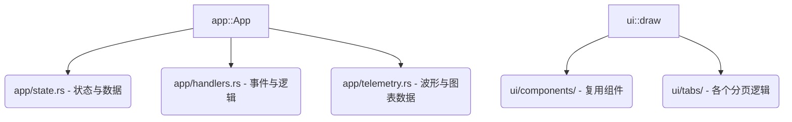

# PioPulse 软件开发与代码规范指南 (Development & Style Guide)

为了确保 `PioPulse` 项目的代码库具有高可读性、高可维护性以及长期的健康度，全体协作开发者（包括 AI 助手与人类工程师）必须严格遵守本开发规范。

---

## 🎯 核心原则：小而美，高内聚，低耦合

当前代码库中存在若干单体大文件（例如 `app.rs` 与 `main.rs`），这为后续的团队协作、冲突合并以及 AI 上下文读取带来了较大挑战。**未来所有的代码编写与功能扩展，必须遵循“单个文件不要太长、逻辑高度模块化”的原则。**

---

## 1. 📏 文件与模块规模限制 (File Size Limits)

* **目标行数 (Target Size)**: 单个 Rust 源文件应控制在 **500 - 800 行** 之间。
* **硬性上限 (Hard Limit)**: 单个文件最大不可超过 **1200 行**。
* **重构阈值 (Refactoring Trigger)**:
  * 当任何文件在开发过程中超过 1000 行，或某一结构体的方法实现（`impl` 块）体积过大时，**必须**启动模块化拆分。
  * **禁止**继续在已有的超大文件中追加庞杂的全新功能模块。

---

## 2. 🧩 模块化与解耦拆分策略 (Modularization Strategy)

未来对现有大模块（如 `app.rs` 与 `ui.rs`）的演进及新功能开发，应采用以下拆分策略：

### 2.1 UI 渲染层的解耦
* **禁止**将所有界面的绘制逻辑堆积在单个 `draw` 方法中。
* 应当在 `src/ui/` 目录下为不同的 Tab 或复杂组件建立独立子文件，如：
  * `src/ui/tabs/plotter.rs` (Plotter 页面绘制)
  * `src/ui/tabs/flasher.rs` (Flasher 页面绘制)
  * `src/ui/components/modal.rs` (通用弹窗/对话框组件)
* 渲染函数仅负责根据读取到的 `App` 状态生成 Widget，**禁止在 UI 渲染周期内执行具有副作用的写操作或 IO 逻辑**。

### 2.2 应用状态 (App State) 与业务逻辑分离
* 随着功能增多，`App` 结构体的功能应合理归类。
* 可以使用 `impl` 块分离的特性，将逻辑按关注点拆分到不同文件中：
  * `src/app/mod.rs` (核心结构体定义与生命周期)
  * `src/app/flasher_actions.rs` (与烧录相关的业务操作)
  * `src/app/serial_actions.rs` (与串口通信、协议切换相关的操作)

---

## 3. 🦀 Rust 编码规范与健壮性 (Rust Best Practices)

### 3.1 严格禁止未捕获的恐慌 (No Panic/Unwrap in Production)
* 在解析器（如 `vofa.rs`）或后台监控线程（如 `worker.rs`）等关键链路上，**禁止**直接使用 `.unwrap()` 或 `.expect()`。
* 必须使用 `Option` 或 `Result`，并通过 `?` 运算符、`unwrap_or` 或 `match` 模式匹配优雅地处理异常。
* 解析器必须具备容错能力，遭遇垃圾字节、错位包或无效 UTF-8 时，应**安全滤除并继续处理**，不能导致整个数据通道死锁或程序退出。

### 3.2 零拷贝与高效内存分配 (Zero-Allocation & Performance)
* 在高频串口通信和波形解析（如 `feed` 循环）中，避免在循环体内频繁申请大块内存。
* 优先使用 `slice`、`chunks_exact` 以及原地修改。
* 对可扩容容器（例如 `IndexFloat` 的多通道数组）在动态扩容时，必须包含合理的边界上限保护（例如不超过 2000 个通道），防止由于单片机发送脏数据导致系统瞬间申请 G 级内存导致 OOM。

---

## 4. 🤝 团队协作与代码提交规范 (Collaboration & Git Commit Rules)

### 4.1 语义化提交信息 (Semantic Commits)
每次提交（Commit）应当清晰分类：
* `feat:` - 新增功能（如 `feat: add rawdata mode to vofa parser`）
* `fix:` - 修复 Bug（如 `fix: prevent indexfloat oom under corrupt data`）
* `refactor:` - 重构代码（如 `refactor: split app.rs layout zone definitions`）
* `docs:` - 文档更新
* `test:` - 添加或修改测试

### 4.2 代码审查（Code Review）关注点
当提交 PR 或进行代码审查时，应重点评估：
1. **有无新增的大文件？** 是否符合文件行数限制？
2. **是否做到了职责单一？** 新增的协议或功能是否开辟了单独的文件/模块？
3. **测试覆盖率是否足够？** 解析器和状态计算逻辑是否有完备的 `#[cfg(test)]` 覆盖？

---

> [!IMPORTANT]
> 任何协作人员在引入新功能或修改现有结构时，若预估代码会使单文件行数超出建议值，必须提前规划模块划分，将其作为子模块（Sub-module）载入。保持代码的清爽与模块化是保证 PioPulse 高质量交付的基石！
