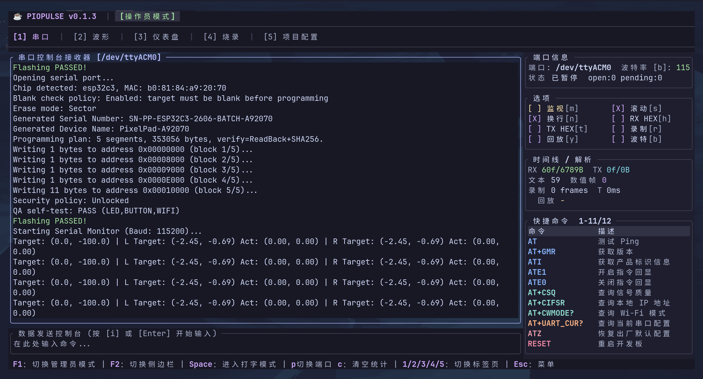
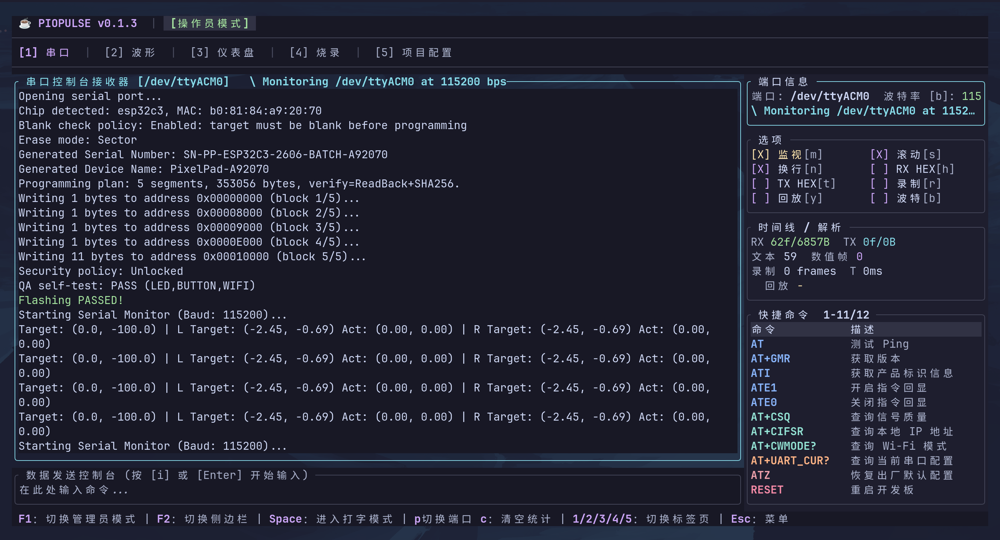
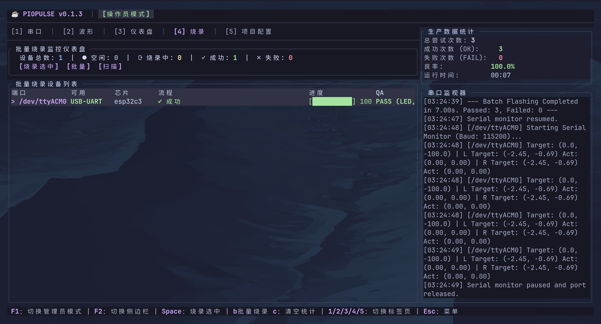
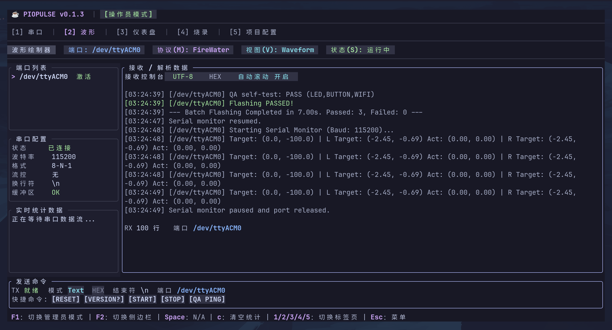

# PioPulse

[](https://crates.io/crates/piopulse)
[](https://opensource.org/licenses/MIT)
[](https://docs.rs/piopulse)

默认中文文档。英文版见：[README.en.md](README.en.md)。

**PioPulse 是一个 TUI 版本的嵌入式调试器。**

它运行在终端里，面向 ESP32 和其他串口类嵌入式设备，把串口调试、遥测绘图、交互仪表盘、批量烧录和产线配置放在同一个键盘优先的界面中。它不是 Web 控制台，也不是桌面 GUI；核心使用场景是在终端中快速连接设备、观察数据、发送命令、记录调试过程，并在需要时进入多工位烧录流程。

## 界面总览

PioPulse 的主界面分为 5 个 TUI 页签：

- `1`：串口调试界面
- `2`：遥测绘图界面
- `3`：组件仪表盘界面
- `4`：批量烧录界面
- `5`：配置界面

下面按界面说明功能。

## 界面预览

截图资源位于 [`sources/`](sources/) 目录，可直接在仓库首页展示主要界面状态。

| 串口调试 | 串口监视 |
| --- | --- |
|  |  |

| 批量烧录 | 遥测波形 |
| --- | --- |
|  |  |

演示视频：[PioPulse TUI 操作录屏](sources/3367a56efd718d1d42ed957b38ccc8f8_raw.mp4)

## 界面 1：串口调试界面

这是 PioPulse 的主要嵌入式调试工作台，用来替代普通串口助手。

这个界面可以：

- 选择当前调试串口
- 启动或停止串口监视
- 查看 RX/TX 调试日志
- 在接收区查看设备输出
- 在发送区输入并发送命令
- 切换波特率
- 切换 RX Hex 显示
- 切换 TX Hex 发送
- 控制发送时是否自动追加换行
- 控制日志是否自动滚动
- 使用快捷命令模板
- 录制串口时间线
- 回放时间线并重新解析数据

常用操作：

- `P`：打开端口选择菜单
- `M`：启动或停止串口监视
- `Space` / `Enter` / `I`：进入发送输入
- `B`：切换波特率
- `H`：切换 RX Hex 显示
- `T`：切换 TX Hex 发送
- `N`：切换自动追加换行
- `S`：切换自动滚动
- `R`：开始或停止时间线录制
- `Y`：开始或停止时间线回放

## 界面 2：遥测绘图界面

这个界面用于把串口中的结构化数据流转换成 TUI 内的实时图形，适合调试传感器、控制器、IMU、PID、电机状态和其他嵌入式遥测数据。

支持的 VOFA+ 数据解析模式：

- FireWater
- JustFloat
- IndexFloat

支持的视图模式：

- 波形图
- 柱状图
- 直方图
- FFT 频谱
- IMU 姿态视图
- ROI 图像/区域预览

这个界面可以：

- 选择采集端口
- 查看当前协议、视图模式和运行状态
- 启动或暂停数据采集
- 清空当前端口的遥测缓冲区
- 缩放、平移和重置波形窗口
- 查看样本数量、通道数量和实时统计
- 使用底部快捷命令向设备发送调试命令

常用操作：

- `M`：切换 VOFA+ 解析模式
- `V`：切换绘图视图
- `Space` / `S`：启动或暂停绘图采集
- `C`：清空当前端口遥测缓冲区
- `+` / `-`：缩放视图
- `,` / `.`：平移视图
- `0`：重置视图
- `[` / `]` 或左右方向键：切换端口

## 界面 3：组件仪表盘界面

这个界面用于搭建 TUI 内的调试面板。它可以把常用控制件和显示件组合成一个嵌入式设备调试仪表盘，适合做参数调试、状态观察和交互控制原型。

当前可添加的组件包括：

- Button
- Slider
- Dial
- Knob
- Toggle
- Light
- Gauge
- Dashboard
- Joystick
- Pad
- Ring
- Cube
- Image
- Delay
- Example

这个界面可以：

- 从模块目录添加组件
- 在分屏布局中显示多个组件
- 选择当前聚焦组件
- 删除当前组件
- 查看当前端口的遥测缓存状态
- 使用 3D Cube 观察或手动调试姿态数据
- 使用按钮、滑块、仪表、指示灯等组件构建设备控制面板

常用操作：

- `A`：打开组件添加菜单
- `D`：删除当前组件
- 左右方向键：切换聚焦组件
- 在 Cube 组件上可使用 `U/J/I/K/O/L` 调整姿态，`R` 重置姿态

## 界面 4：批量烧录界面

这个界面是 PioPulse 的产线烧录工作台，用于多串口、多设备并发烧录。它仍然是 TUI 调试器的一部分，但面向更接近工厂或实验室批量验证的流程。

这个界面可以：

- 自动扫描 USB 串口设备
- 显示当前可烧录设备列表
- 并发执行多个设备的烧录任务
- 每个设备独立显示状态、进度和结果
- 单个设备失败时不阻塞其他设备
- 读取芯片与 MAC 信息
- 生成并写入 NVS 身份数据
- 记录 SN、Device Name、批次、固件版本和 Trace ID
- 展示校验方式、QA 结果、安全状态和写入字节数

设备表会显示的典型信息包括：

- 端口
- 目标芯片
- MAC 地址
- SN
- Device Name
- 固件版本
- 批次号
- 当前流程状态
- 烧录进度
- QA 结果
- 安全状态
- Trace ID

常用操作：

- `Space`：烧录选中的设备
- `B`：批量烧录全部设备
- `C`：在未烧录时清空生产统计
- `F2`：在宽屏终端中显示或隐藏侧边栏

## 界面 5：配置界面

这个界面用于维护项目配置、烧录参数和产线策略。配置页默认受管理员模式保护，避免操作员误改关键参数。

可以配置的内容包括：

- 项目名称
- 芯片类型
- 波特率
- Flash 模式、频率和大小
- bootloader、partitions、otadata、app 固件路径与偏移
- NVS 偏移
- 校验方式
- 空片检查策略
- 擦除模式
- 增量烧录开关
- Secure Boot 策略
- Flash Encryption 策略
- 烧录后锁定策略
- 操作员角色
- 固件版本
- SN 前缀
- 批次号
- MES 地址
- 标签模板
- QA 测试脚本

## 默认烧录包

烧录时优先读取当前目录的 `piopulse.toml`。如果没有这个文件，会继续查找 `build/piopulse.toml`；如果 `build/` 目录里只有标准命名的 bin 文件，也会自动生成默认分段清单。

推荐的产线包结构：

```text
build/
  piopulse.toml
  bootloader.bin
  partitions.bin
  boot_app0.bin
  firmware.bin
  factory_merged.bin
```

推荐的 `piopulse.toml`：

```toml
name = "PixelPad ESP32-S3 Production"
chip_type = "ESP32-S3"
baud_rate = 921600
flash_mode = "dio"
flash_freq = "80m"
flash_size = "16MB"
do_not_chg_bin = true
nvs_offset = "0x9000"
verify_method = "ReadBack+SHA256"
use_merged_flash = false
merged_offset = "0x0000"

# 这里描述烧录包自身是否已经预加密。默认 generated factory 包是明文 bin。
# disabled: 明文镜像；device_runtime: 设备侧 flash encryption 策略意图；pre_encrypted: 文件已预加密。
flash_encryption = false
flash_encryption_mode = "disabled"
secure_boot = false
lock_after_flash = false

[[images]]
label = "bootloader"
path = "bootloader.bin"
offset = "0x0000"
required = true
encrypted = false

[[images]]
label = "partitions"
path = "partitions.bin"
offset = "0x8000"
required = true
encrypted = false

[[images]]
label = "boot_app0"
path = "boot_app0.bin"
offset = "0xe000"
required = true
encrypted = false

[[images]]
label = "firmware"
path = "firmware.bin"
offset = "0x10000"
required = true
encrypted = false

[[images]]
label = "factory_merged"
path = "factory_merged.bin"
offset = "0x0000"
required = true
encrypted = false
```

常用操作：

- `F1`：进入或退出管理员模式
- 上下方向键：选择配置项
- `Enter`：在管理员模式下编辑当前配置项
- `Esc`：取消编辑或退出弹窗
- `Space`：在配置确认后也可触发烧录流程

## 运行

```bash
cargo run
```

## 全局快捷键

- `1`：串口调试界面
- `2`：遥测绘图界面
- `3`：组件仪表盘界面
- `4`：批量烧录界面
- `5`：配置界面
- `F1`：管理员模式解锁/锁定
- `F2`：显示/隐藏侧边栏
- `Esc`：退出、关闭弹窗或取消编辑
- `Q`：打开退出菜单

## 项目结构

- `src/main.rs`：终端初始化、事件循环、键盘/鼠标分发
- `src/app.rs`：应用状态、通道状态、统计、端口扫描、交互处理
- `src/ui.rs`：主布局和 Tab 路由
- `src/ui/serial.rs`：串口调试界面和快捷命令面板
- `src/ui/plotter.rs`：遥测绘图界面
- `src/ui/widgets/`：组件仪表盘界面和组件实现
- `src/ui/channels.rs`：批量烧录设备表和产线看板
- `src/ui/config.rs`：项目配置和产线参数配置
- `src/worker.rs`：后台烧录任务和串口监视任务
- `src/nvs.rs`：ESP32 NVS 身份数据生成

## 当前状态说明

PioPulse 当前已经实现 TUI 串口调试、串口监视、命令发送、时间线录制/回放、VOFA+ 数据解析、TUI 遥测绘图、组件仪表盘、ESP32 串口烧录、MAC 读取、SN/NVS 生成写入和批量烧录看板。

MES 上传、标签打印、Secure Boot eFuse 锁定、Flash Encryption 实际启用、完整硬件 QA 脚本等能力已经进入配置和流程状态，但还需要按具体工厂环境继续接入真实后端或设备接口。
